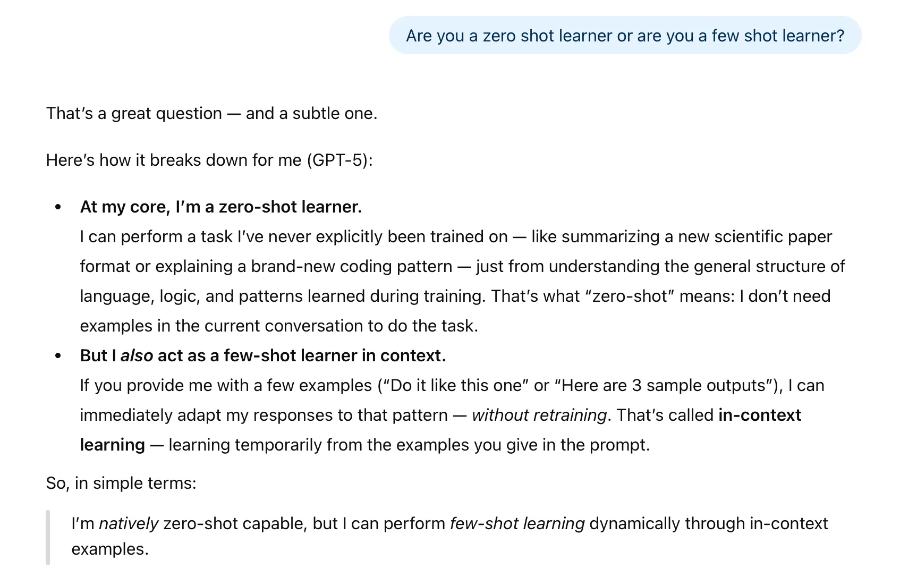

<link rel="stylesheet" href="https://unpkg.com/open-props" />

## The Historical Evolution of Generative Pre-trained Transformers

Understanding the chronological development of GPT models is crucial to appreciating their architecture and capabilities. The progression from 2017 to the present reveals a clear strategy of iterative scaling in both model size and dataset volume, leading to today's state-of-the-art language models.

### 2017: The Foundation - "Attention Is All You Need"

The journey began with the 2017 paper "Attention Is All You Need", which introduced the Transformer architecture. Its primary breakthrough was the self-attention mechanism, a method for capturing long-range dependencies in text more effectively than previous models like RNNs and LSTMs. The original Transformer architecture included both an **encoder and a decoder** block.

### 2018: The Birth of GPT - Generative Pre-training

Published in 2018, the first GPT paper, "Improving Language Understanding by Generative Pre-training," introduced two key ideas: **generative pre-training** and a reliance on **unsupervised learning**. The core architectural change was the **removal of the encoder block**, using only the decoder from the original Transformer. The paper's central claim was that significant gains could be achieved by pre-training on a diverse, unlabeled corpus: "we demonstrate that large gains on these tasks can be realized by generative pre-training of a language model on a diverse corpus of unlabeled text".


**Generative Pre-Training Paper**  
 Research Paper [Link](https://cdn.openai.com/research-covers/language-unsupervised/language_understanding_paper.pdf)  
Find all the latest research papers published by OpenAI [here](https://openai.com/research/index/publication/)


 


**Improving language understanding with unsupervised learning**  
Blog Link: [Improving language understanding with unsupervised learning](https://openai.com/index/language-unsupervised/)  
This established the foundation for training large models on vast amounts of internet text. An OpenAI blog post on June 11, 2018, supported this approach, highlighting the combination of **Transformers** and **unsupervised pre-training**.


### 2019: Scaling Up - GPT-2

The 2019 follow-up paper, "Language Models are Unsupervised Multitask Learners," was primarily a demonstration of scale. The researchers applied the same generative pre-training approach but with more data and a larger model. OpenAI released four sizes of the GPT-2 model:

- **Small**
- **Medium**
- **Large**
- **Extra-large** (with **1,542 million**, or ~1.5 billion, parameters)
![Architecture Hyperparameters for the 4 model size][parameters]


**Language Models are Unsupervised Multitask Learners Paper**  
 Paper [Link](https://cdn.openai.com/better-language-models/language_models_are_unsupervised_multitask_learners.pdf)


### The Modern Era: GPT-3.5, GPT-4 and now GPT-5

Following GPT-3, **GPT-3.5** became commercially viral, powering the initial release of ChatGPT and bringing LLM technology to the mainstream. The development of GPT-4 is based on a large-scale, multimodal model which can accept image and text inputs and produce text outputs. While less capable than humans in many real-world scenarios, GPT-4 exhibits human-level performance on various professional and academic benchmarks, including passing a simulated bar exam with a score around the top 10% of test takers.

The current state-of-the-art model is **GPT-5** representing the latest milestone in this rapid evolutionary path.


**GPT-4 Technical Report and GPT-5 System Card**  
 GPT-4 Paper [Link](https://arxiv.org/pdf/2303.08774v1)  
 GPT-5 [System Card](https://cdn.openai.com/gpt-5-system-card.pdf)


## Core Concepts: Zero-Shot vs. Few-Shot Learning

The distinction between zero-shot: and few-shot: learning is fundamental to understanding how modern LLMs are prompted and evaluated. 

Zero-shot learning is the ability to perform a task with only a description, without any examples. More like ability to generalize to completely unseen tasks without any prior specific examples.

Few-shot learning is the ability to learn from a small number of examples provided in the prompt. More like learning form a minimum number of examples which the user provides as input.

The GPT-3 paper uses the example of translating the word 'cheese' into French to illustrate the concepts:

- Zero-shot: The prompt is simply: `Translate English to French: cheese ->`
- One-shot: The prompt provides one example: `Translate English to French: sea otter -> loutre de mer, cheese ->`
- Few-shot: The prompt provides multiple examples: `Translate English to French: sea otter -> loutre de mer, peppermint -> menthe poivrée, giraffe -> girafe, cheese ->`
![Zero Shot - One Shot - Few Shot][shot]

### GPT-3's Position as a "Few-Shot Learner"

The GPT-3 paper explicitly claims that the model is a strong **few-shot learner**. Its performance improves dramatically when it is given a few examples within the prompt. The paper highlights its success in this setting on tasks such as **unscrambling words**, using a **novel word in a sentence**, and performing **three-digit arithmetic**.

### GPT-4's Capabilities
![GPT-4o Capabilities][gpt4o]
When queried directly, GPT-4 describes itself as having both zero-shot and few-shot capabilities. However, it clarifies its strengths and weaknesses:  
[GPT-4]: *I am a few-shot learner... while I can handle many tasks without prior examples which is zero shot learning providing examples helps me generate more accurate responses*

When asked whether GPT-4o also had zero shot capabilities below was the response:  
[GPT-4]: *Yes I also have zero shot capabilities this means that I can perform tasks and answer questions without needing any prior examples or specific context*

The synthesis is that while GPT-4 is capable of zero-shot learning, it functions more accurately and reliably as a few-shot learner. Providing examples is key to getting the best possible responses.


**GPT-5’s Capabilities**  



## The Engine of GPT-3: Data, Cost, and Architecture

Building a model like GPT-3 requires an immense scale across three pillars: an enormous dataset, significant financial investment for compute power, and a massively scaled-up architecture. This scale is what enables its powerful and generalizable capabilities.

### The Training Dataset

GPT-3 was pre-trained on a dataset of approximately 300 billion tokens. For intuition, think of a token as roughly one word. The dataset was composed of several sources:

- **Common Crawl**: 410 billion tokens (60% of the training mix)
- **WebText2**: 19 billion tokens (22% of the training mix)
- **Books & Wikipedia**: The remaining ~18% of the data

### Pre-training Cost and Fine-Tuning

The total estimated cost for the initial training of the GPT-3 model was $4.6 million. This initial process creates what is known as a **pre-trained**, **base**, or **foundational model**.

After pre-training, these models can undergo **fine-tuning**. This is a secondary training process where the foundational model is further trained on a smaller, specific, and often labeled dataset from a particular domain (e.g., banking, education). Fine-tuning adapts the model to a specific task, leading to more reliable and robust performance for production use cases. This high initial investment in pre-training makes fine-tuning an economically viable and necessary step for commercial applications, allowing companies to leverage the foundational model's power without incurring the full cost.

### Open Source vs. Closed Source Ecosystem

Models like GPT-4 are **closed source**, meaning their internal weights and parameters are not publicly available. In contrast, the **open source** ecosystem is rapidly advancing. The performance gap between closed and open models is closing, exemplified by Meta's Llama 3.1 405B, an open-source model with 405 billion parameters. As of August 2024, its performance is described as being comparable to or even better than GPT-4.
![Performance][performance]

### GPT's Decoder-Only Architecture

A key architectural decision for GPT models is the exclusive use of the **decoder block** from the original Transformer. While the original Transformer had six encoder-decoder blocks, GPT-3 scales this simplified structure to an immense degree, featuring 96 Transformers **(decoder) layers** and 175 billion **parameters**. This decoder-only focus is a natural fit for GPT's auto-regressive, next-word prediction task, as its primary function is to generate sequences based on prior context, rather than transforming an input sequence into a different output sequence (the encoder's role).

## The Training Mechanism: Unsupervised & Auto-Regressive Learning

Despite its complex emergent abilities, GPT's core training mechanism is elegant and simple. It is based on the principles of unsupervised learning and auto-regression, all centered on a single, fundamental task: predicting the next word in a sequence.

### Unsupervised / Self-Supervised Learning

The training is considered unsupervised because no human-provided labels are required. The structure of the text data itself provides the supervision; the next word in any given sentence acts as the ground-truth label. 

The training process works as follows: the model predicts a word, compares its prediction to the actual word in the text, computes the error, and uses backpropagation to update its 175 billion weights to minimize that error.
![GPT-3 Training][gpt3]

### The Auto-Regressive Process

The model is auto-regressive because the output from the previous step is used as part of the input for the next step. This creates an iterative loop that allows the model to generate sequences of text.
![Auto Regressive][autoregressive]

The process is illustrated with this example:

1. **Input:** `Second law of Robotics:` -> **Output:** `a`
2. **Input:** `Second law of Robotics: a` -> **Output:** `robot`
3. **Input:** `Second law of Robotics: a robot` -> **Output:** `must`

In the first iteration, the input `This` is processed to predict the next word, `is`. The output becomes `This is`. In the second iteration, `This is` becomes the new input, which is used to predict `an`. The output is now `This is an`. This entire phrase then serves as the input for the third iteration, which predicts `example`, completing the sentence. This iterative cycle, where the model's own predictions extend the context for subsequent predictions, is the essence of auto-regressive generation.

## The Surprising Outcome: Emergent Behavior

One of the most fascinating results of training large-scale language models is the phenomenon of emergent behavior. This is formally defined as:  
"the ability of a model to perform tasks that the model wasn't explicitly trained to perform."


**Emergent Abilities of Large Language Models Paper**  
Paper [Link](https://arxiv.org/pdf/2206.07682v1)


### Examples of Emergent Capabilities

Although GPT is only trained on next-word prediction, it develops the ability to perform a vast range of complex tasks it was never explicitly taught. Examples include:

- Answering text questions
- Generating worksheets
- Summarizing text
- Creating lesson plans
- Creating report cards
- Generating PowerPoint presentations
- Grading essays
- Language translation

### An Active Area of Research

This outcome was surprising even to researchers and remains an open question in the field. An OpenAI blog post noted this phenomenon: 
"we noticed that we can use the underlying language model to begin to perform tasks without ever training on them."

## Recap and Conclusion

Summary of the key concepts covered:

- **Historical Timeline:** The evolution from the 2017 Transformer paper through GPT, GPT-2, GPT-3, and finally to the current GPT-4.
- **Learning Paradigms:** The distinction between zero-shot and few-shot learning, with GPT models excelling as few-shot learners.
- **Scale of GPT-3:** The model was trained on 300 billion tokens, cost $4.6 million to pre-train, and contains 175 billion parameters.
- **Training Process:** The training is unsupervised (self-supervised) and auto-regressive, focused entirely on next-word prediction.
- **Emergent Behavior:** The surprising ability of the model to perform tasks far beyond its training objective is a key outcome and an active research area.

## Key Takeaways

- **Decoder-Only Architecture:** Unlike the original Transformer which used both an encoder and a decoder, GPT models exclusively use the **decoder block**, simplifying the architecture but scaling it massively with more layers (e.g., 96 layers in GPT-3).
- **Unsupervised Pre-training:** GPT is pre-trained in an **unsupervised (or self-supervised)** manner. It requires no externally labeled data because the text itself provides the labels; the next word in a sentence is the target for prediction.
- **Auto-Regressive Process:** The model is **auto-regressive**, meaning the output from one step (a predicted word) is fed back as part of the input for the next step, allowing it to generate coherent sequences of text iteratively.
- **Few-Shot Learning Dominance:** The GPT-3 paper positioned the model as a powerful **few-shot learner**. Its performance on tasks like translation or arithmetic improves significantly when provided with a few examples in the prompt, a capability that GPT-4 inherits and refines.
- **Massive Scale is Key:** The leap from GPT-2 to GPT-3 demonstrated that massive increases in parameters (from ~1.5 billion to 175 billion) and data (300 billion tokens) were crucial for unlocking new capabilities.
- **Pre-training vs. Fine-tuning:** The initial, costly training on a broad dataset is called **pre-training**, creating a foundational model. This model can then be **fine-tuned** on a smaller, domain-specific dataset to improve performance for production-level applications.
- **Emergent Behavior:** One of the most surprising outcomes of scaling LLMs is **emergent behavior**—the ability to perform tasks the model wasn't explicitly trained for, such as language translation, essay grading, and generating multiple-choice questions.
- **Closing Open-Source Gap:** While closed-source models like GPT-4 have historically led in performance, powerful open-source alternatives like Meta's **Llama 3.1** (with 405 billion parameters) are now achieving comparable or even superior results.

[parameters]: img/parameters.png
[shot]: img/shot.png
[gpt4o]: img/gpt4o.png
[gpt5]: img/gpt5.png
[performance]: img/performance.png
[gpt3]: img/gpt3-training-language-model.gif "Source: https://jalammar.github.io/how-gpt3-works-visualizations-animations/"
[autoregressive]: img/autoregressive.png "Source: https://jalammar.github.io/how-gpt3-works-visualizations-animations/"