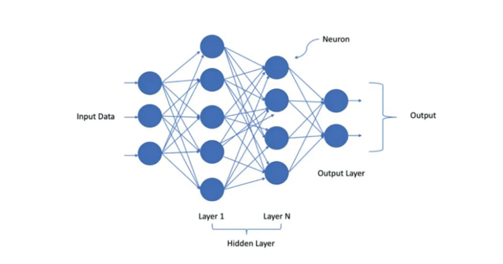
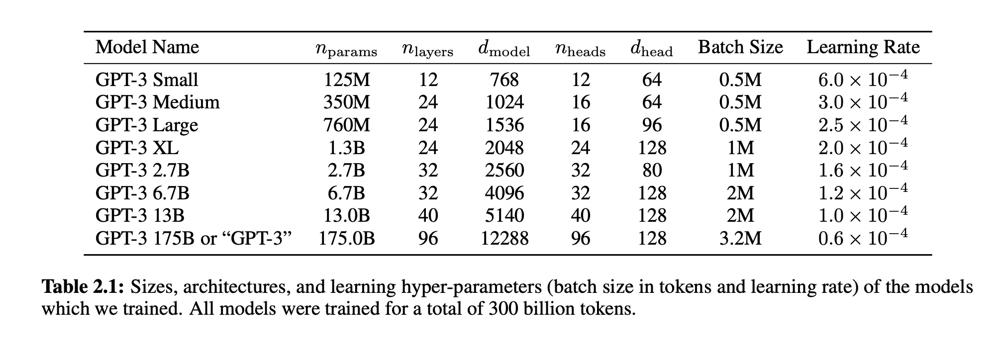
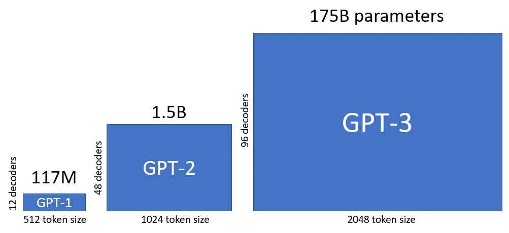
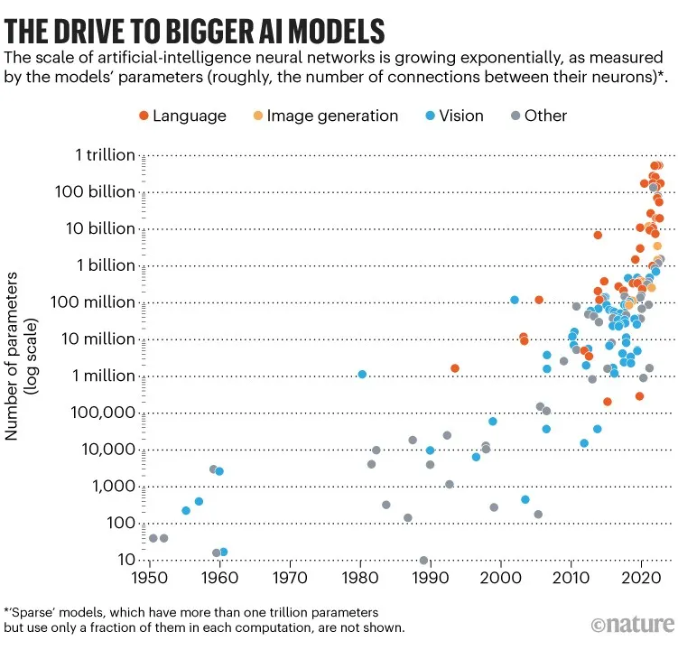
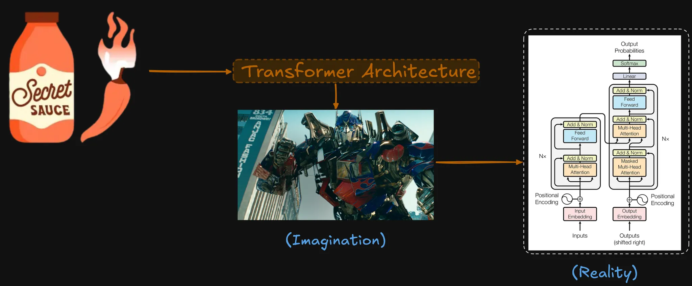
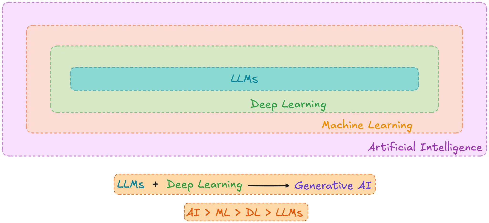

<link rel="stylesheet" href="https://unpkg.com/open-props" />

## What is a Large Language Model (LLM)?

**Neural networks designed to understand, generate and respond to human like text. Deep Neural Networks (DNN) trained on massive amounts of text data.**

_A neural network looks like this diagram: input data → feeds into layer of neurons → output layer_

The reason it is called neurons because these neurons represent the circuitry in our brain or they do so in a very symbolic sense.
DNN are shown to have a huge number of applications in image detection, text generation, self driving cars, detecting brain tumor etc.

At the core LLMs are neural network sounding more and more like humans.

## Large Language Models (LLMs)

### What does Large mean in the Large Language Models?

Why not just a language model? After all it is just a model dealing with language right? Why do we specifically have this one more term called **Large**?

The reason is because until LLMs came into the picture, model sizes were not very big and when I mean model size, I mean the number of parameters in the model. But if you know about the number of parameters which they deal with you will be shocked. **LLM Models have billions of parameters.** It is a huge number of parameters.

This is a table which shows the number of parameters in GPT.
Currently GPT-5 is rumored to have 2-5 trillion parameters (officially OpenAI did not disclose).
This is why they are called **Large** Language Models.

Here is another graph that shows the comparison between **GPT-1** to **GPT-3**.

From **GPT-1** to **GPT-2** there is a factor of `10`, meaning parameters increased from **~100M** to **~1B**.
But from **GPT-2** to **GPT-3**, there is a factor of `100`. The parameters increased from **1.5B** to **175B**.

Here is a graph which shows model size in AI type of models over the period of years:

### And why are they called Language Models?

These models do a wide range of NLP tasks: question answering, translation, sentiment analysis and much more.

## LLMs vs Earlier NLP Models

Natural Language Processing (NLP) models existed long before LLMs. The primary differences are in scope and application capability.

**NLP:** designed for specific tasks like language translation etc.  
**LLMs:** can do wide range of NLP tasks

It turns out that if you train a GPT for text completion, that same architecture works well for language translation also and it is pretty generic that way.

Earlier language models could not write an email from custom instructions, a task that is trivial for modern LLMs.

| Feature | Earlier NLP Models | Modern LLMs |
| --- | --- | --- |
| **Scope** | Designed for **specific tasks** (e.g., one model for translation only, another for sentiment analysis only). | Can do a **wide range of NLP tasks** using the same generic architecture (e.g., a model trained for text completion also works well for translation). |
| **Application Complexity** | Found it very difficult to perform tasks requiring complex, custom instructions, such as drafting an email based on specific requests. | These complex tasks are **trivial** (e.g., ChatGPT can draft a detailed email with custom instructions and emojis almost instantly). |

## What makes LLMs so good? Secret sauce?

What is that magic bullet that makes LLMs better than NLP? And that magic bullet or secret sauce for LLMs is **Transformer Architecture**. We will learn all about this secret sauce in subsequent series.

> ### Foundation Paper
>The architecture originated from a seminal paper published in 2017 titled **"Attention Is All You Need,"** authored by eight researchers from Google Brain.  
> Paper Link: https://arxiv.org/pdf/1706.03762  
> This paper has received **more than 100,000 citations in just five years**, demonstrating its revolutionary impact on artificial intelligence

## LLM vs GenAI vs Deep Learning vs Machine Learning

These terminologies form a nested structure, with each term being a subset of the one preceding it:

- **Artificial Intelligence (AI):** The broadest umbrella, covering any machine that behaves remotely like humans or exhibits some form of intelligence.
    - *AI Example:* A **rule-based chatbot** (e.g., a flight assistant) is AI because it demonstrates intelligence, but since it is programmed to give fixed answers and does not learn or adapt based on user responses, it is **not** Machine Learning.
- **Machine Learning (ML):** A subset of AI where machines **learn and adapt** based on how users interact with them.
- **Deep Learning (DL):** A subset of ML that **usually only involves neural networks**.
    - ML is broader than DL because it includes methods that are **not neural networks**, such as decision trees (e.g., predicting heart disease based on patient data like age, cholesterol, and ECG).
    - *DL Examples:* Image detection using Convolutional Neural Networks (CNNs) and handwritten digit classification.
- **Large Language Models (LLM):** The smallest subset within DL. LLMs are a specific application of deep learning techniques, but unlike general DL which involves images and other modalities, **LLMs deal exclusively with text**.

**Generative AI**

**Generative AI** can be thought of as a **mixture of LLMs plus Deep Learning**. Generative AI uses deep neural networks to create new content across various modalities (text, images, sound, video, and other media), whereas LLMs are confined only to text generation.

## Applications of LLMs

The applications of LLMs are vast, constantly increasing, and described as having **"the sky is the limit"** potential. They generally fall into five major categories:

1. **Creating New Content / New Text Generation:** Writing unique text that did not exist previously in literature, such as writing books, media articles, or highly specific content like a poem about the solar system in the format of a detective story.

2. **Chatbots / Virtual Assistants:** LLMs serve as virtual assistants, enabling conversational interaction. This is a major application, with automation rapidly occurring in large sectors like banking, airlines, and hotel reservations. Completing this series will equip learners to develop their own chatbots.

3. **Machine Translation:** LLMs can quickly and accurately translate text into any language (e.g., French translation demonstrated). They also offer some support for regional languages, which is an active area of research.

4. **Sentiment Analysis:** LLMs can analyze large bodies of text to identify sentiment, a function useful for applications like hate speech detection on social media platforms (e.g., Twitter, Instagram).

5. **Specialized Applications (Demo):** LLM knowledge allows for the creation of powerful applications, such as a portal demonstrated for school teachers, capable of generating:
    - **Lesson Plans:** Creating structured lesson plans on specific topics (e.g., gravity) aligned with particular curricula (e.g., CBSE curriculum of India), complete with objectives, assessment, and guided practice.
    - **McQ Generator:** Generating multiple-choice questions (MCQs) of varying difficulty (hard, medium, easy) on historical topics (e.g., World War II), along with correct answers and explanations.