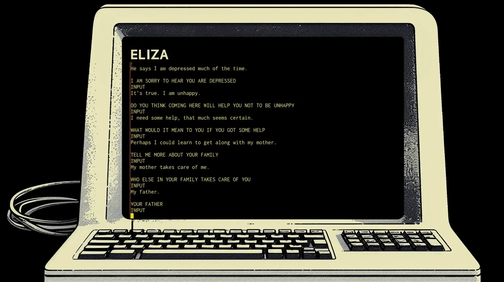
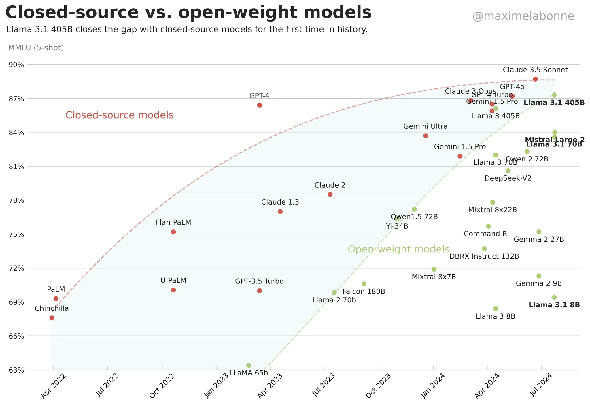
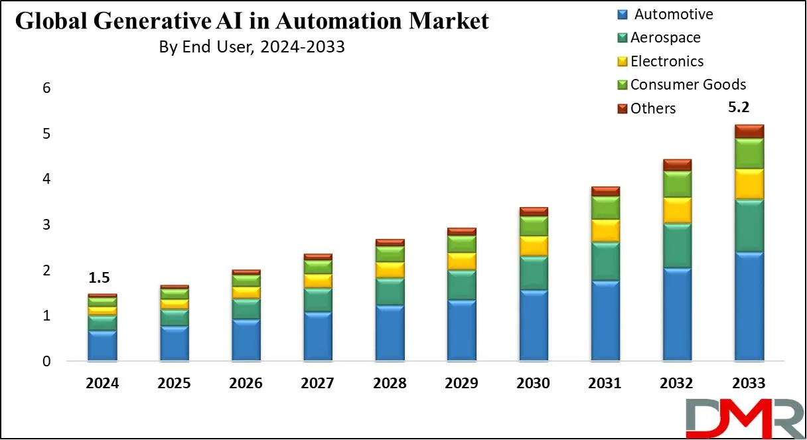

## Motivation

### The LLM Landscape and Job Market

- **Transformation:** Large Language Models (LLMs) and Generative AI are transforming the world, leading to new startups, company shifts, and a significant rise in jobs.
- **Job Growth:** The global Generative AI job market is projected to grow five to six times in the next five years, making skills in this area extremely useful and increasingly necessary.
- **Generative AI Scope:** Generative AI is a broader subset encompassing language, video, audio, and 3D models. AI-generated videos shown are incredibly realistic, demonstrating the current power of the field.

### Critique of Current Learning Methods

- **Common Mistake:** Many learners skip foundations and jump directly to applications, running code from YouTube videos or Google Colab notebooks without understanding the underlying mechanisms.
- **Inadequate Resources:** Existing courses often focus on application development (e.g., "build llm apps") or are quick crash courses that do not teach how to build an LLM from scratch or cover the "nuts and bolts".
    - Specific examples noted include quick playlists (only 10–15 minutes per chapter) and complex, non-beginner-friendly courses (like Andrej Karpathy's 90-minute GPT course).
- **Need for Depth:** The speaker is looking to create a "massive deep technical course" that covers the foundations in detail and depth, moving beyond quick fixes.

### The Series Goal

- **Objective:** To build a large language model completely from scratch.
- **Outcome:** Students who successfully complete the playlist will feel very confident about the subject, and application parts that come later will seem "extremely easy".
- **Career Advantage:** Understanding how to build an LLM from scratch equips learners with the detailed knowledge (e.g., about key query and values, or positional encoding) needed to succeed in job interviews, positioning them better than those who only deploy applications by cloning GitHub repositories.

## Historical Context: LLMs Then and Now

One of the first chatbots which humans developed called ELIZA. It was supposed to be a therapist.

- **1960s (Elisa):** One of the first chatbots, Elisa, was intended as a therapist. Demonstrations show that the conversation proceeded nowhere, illustrating the rudimentary state of NLP 50–60 years ago.
- **Modern Day (ChatGPT):** Current LLMs like GPT are extremely useful, sophisticated, and provide immediate, relevant answers (e.g., recommending books, courses, and research papers). The series aims to guide students in building their own GPT.

> [!NOTE]
> ### Try the web version of ELIZA here
> [Masswerk's Eliza](https://www.masswerk.at/eliza/)  
> Read: https://www.nextpit.com/opinions/tbt-early-chatbot-eliza

## Open Source vs. Closed Source Models

- **Closed Source:** Models released by companies like OpenAI (e.g., GPT-4) typically do not release the weights or the full architecture.
- **Open Source:** Models like Meta's Llama 3.1 make the entire architecture available to the public.
- **Current Trend:** While most models were closed source when the field boomed in 2022, by 2024, the performance gap between open-source and closed-source models is slowly decreasing. Llama 3.1, an open-source model, now performs at the same level as closed-source GPT-4, meaning all necessary information for learning is now readily available.

## How important is Generative AI skill?

Check the below video from [Runwayml](https://runwayml.com/)

https://github.com/user-attachments/assets/c67645b2-fca9-44f7-984d-43aa77aef6ee

These videos are not shot on camera or video recording device. These are created by using AI. This is the power of Generative AI currently.

What is probably more relevant to all readers is the global Generative AI job market. The growth looks incredible. The projected job market is expected to grow 5 to 6 times in the next 5 years.

The Generative AI and LLM skills are extremely important and are only going to increase in the future.
