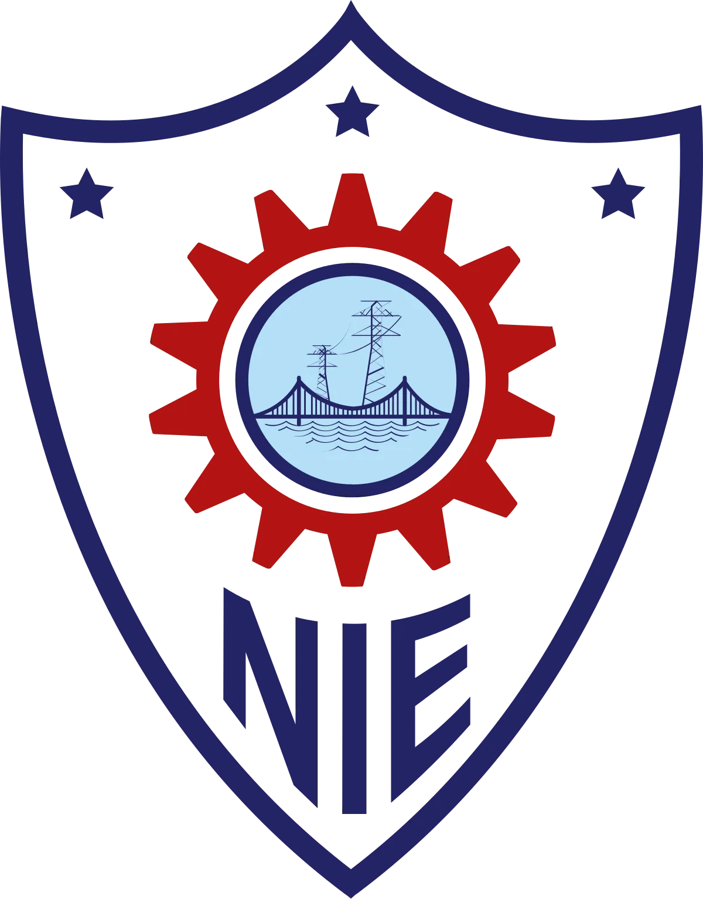
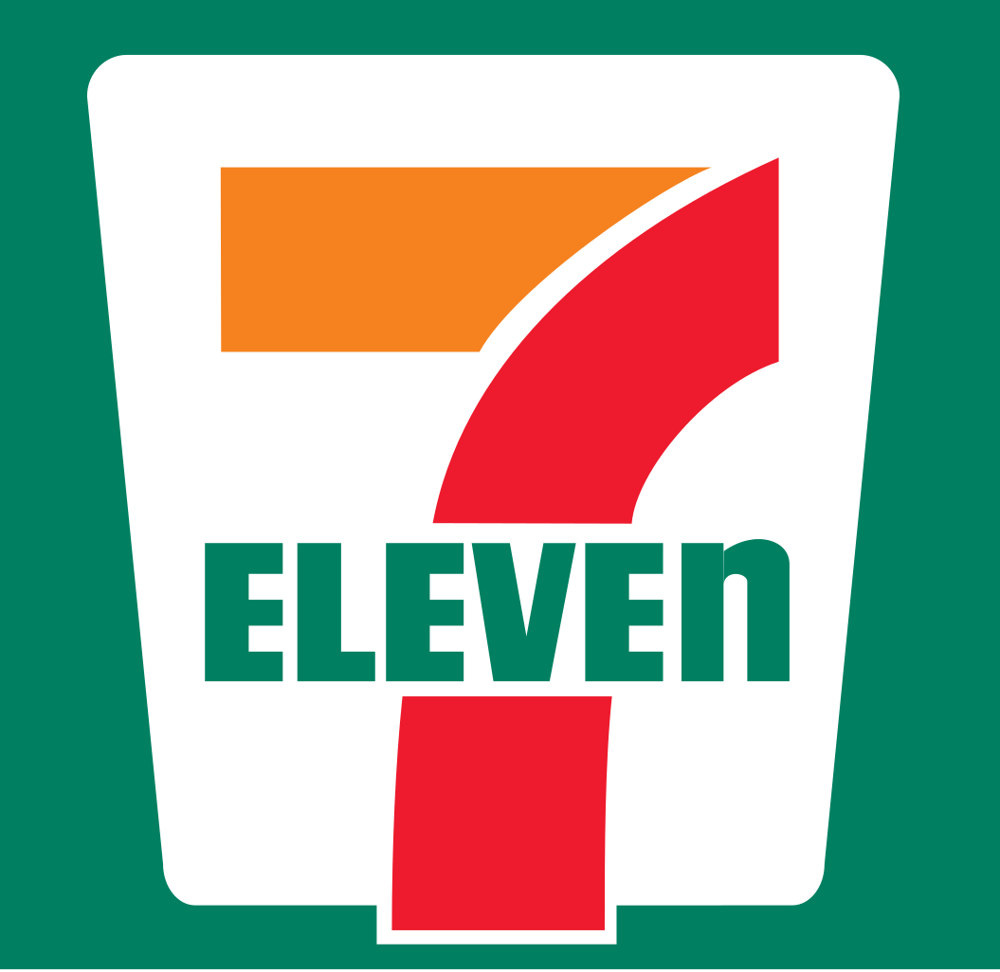

## Education

<table>
    <thead>
        <tr>
            <th>School</th>
            <th>Link</th>
            <th>Degree</th>
            <th>Date</th>
        </tr>
    </thead>
    <tbody>
        <tr>
            <td></td>
            <td><a href="https://micromasters.mit.edu/ds/" target="_blank">MIT xPro</a></td>
            <td>Mini Masters in Statistics & Data Science</td>
            <td>2025</td>
        </tr>
        <tr>
            <td></td>
            <td><a href="https://www.uab.edu/home/" target="_blank">University of Alabama at Birmingham</a></td>
            <td>Masters in Data Science</td>
            <td>2024</td>
        </tr>
        <tr>
            <td></td>
            <td><a href="https://www.nie.ac.in" target="_blank">National Institute of Enginering</a></td>
            <td>Bachelors in Information Science</td>
            <td>2017</td>
        </tr>
    </tbody>
</table>

## Publications

<table>
    <thead>
        <tr>
            <th>Journal</th>
            <th>Title</th>
            <th>Description</th>
            <th>Link</th>
        </tr>
    </thead>
    <tbody>
        <tr>
            <td></td>
            <td>Sensitivity-Positional Co-Localization in GQA Transformers</td>
            <td>Discovered that task-sensitive and RoPE-influential layers sit at opposite ends of Llama 3.1 8B, yet targeting both LoRA and RoPE adaptations at the sensitive layers beats all alternatives by 4–16pp across six benchmarks at just $100 compute - proving where you fine-tune matters more than why.</td>
            <td><a href="https://doi.org/10.48550/arXiv.2604.07766" target="_blank">arXiv</a></td>
        </tr>
    </tbody>
</table>

## Projects

<table>
    <thead>
        <tr>
            <th>Project</th>
            <th>Name</th>
            <th>Description</th>
            <th>Link</th>
        </tr>
    </thead>
    <tbody>
        <tr>
            <td></td>
            <td>Production RAG Application for Human Nutrition</td>
            <td>A production-ready Retrieval-Augmented Generation (RAG) chatbot built from scratch, specializing in human nutrition knowledge. This application processes a comprehensive nutrition PDF and enables intelligent Q&A through semantic search and large language model integration.</td>
            <td><a href="https://github.com/mcrao/RAG/tree/main/prod-rag" target="_blank">GitHub</a></td>
        </tr>
        <tr>
            <td></td>
            <td>Google's NotebookLM Clone</td>
            <td>A full-stack AI-powered application that replicates Google's NotebookLM functionality. Upload PDF documents, chat with them using advanced RAG (Retrieval-Augmented Generation), and automatically generate engaging podcast-style audio conversations with AI hosts discussing the document content.</td>
            <td><a href="https://github.com/mcrao/Build-Notebook-LM-Clone" target="_blank">GitHub</a></td>
        </tr>
        <tr>
            <td></td>
            <td>Enhanced Groq Code CLI</td>
            <td>This is an enhanced version of the original Groq Code CLI with additional features including MCP integration, developer tools, and a refreshed purple-turquoise color scheme. All credit for the original codebase goes to the Groq team.
            </td>
            <td><a href="https://github.com/mcrao/groq-code-cli-enhanced" target="_blank">GitHub</a></td>
        </tr>
    </tbody>
</table>

## Experience

<table>
    <thead>
        <tr>
            <th>Company</th>
            <th>Link</th>
            <th>Role</th>
            <th>Dates</th>
            <th>Type</th>
        </tr>
    </thead>
    <tbody>
        <tr>
            <td></td>
            <td><a href="https://www.7-eleven.com/" target="_blank">7-Eleven, Inc</a></td>
            <td>Machine Learning Engineer</td>
            <td>2024-Present</td>
            <td>Full Time</td>
        </tr>
        <tr>
            <td></td>
            <td><a href="https://www.7-eleven.com/" target="_blank">7-Eleven, Inc</a></td>
            <td>Machine Learning Intern</td>
            <td>2024 (Summer)</td>
            <td>Full Time</td>
        </tr>
        <tr>
            <td></td>
            <td><a href="https://www.kentucky.gov/Pages/home.aspx" target="_blank">Commonwealth of Kentucky</a></td>
            <td>Student University Partnership Intern</td>
            <td>2024 (Spring)</td>
            <td>Remote</td>
        </tr>
        <tr>
            <td></td>
            <td><a href="https://www.7-eleven.com/" target="_blank">7-Eleven, Inc</a></td>
            <td>Lead Data Engineer</td>
            <td>2022-2023</td>
            <td>Full Time</td>
        </tr>
        <tr>
            <td></td>
            <td><a href="https://www.concentrix.com/" target="_blank">Concentrix iLabs</a></td>
            <td>Senior Data Engineer</td>
            <td>2021-2022</td>
            <td>Remote</td>
        </tr>
        <tr>
            <td></td>
            <td><a href="https://www.ltimindtree.com/" target="_blank">Mindtree Limited</a></td>
            <td>Senior Data Engineer</td>
            <td>2017-2021</td>
            <td>Full Time</td>
        </tr>
    </tbody>
</table>
